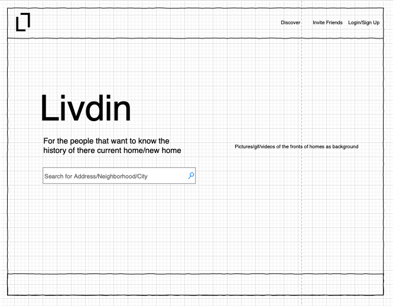
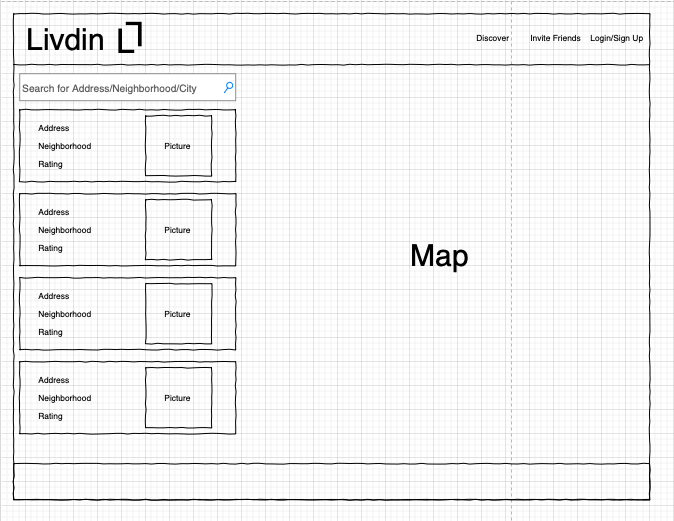
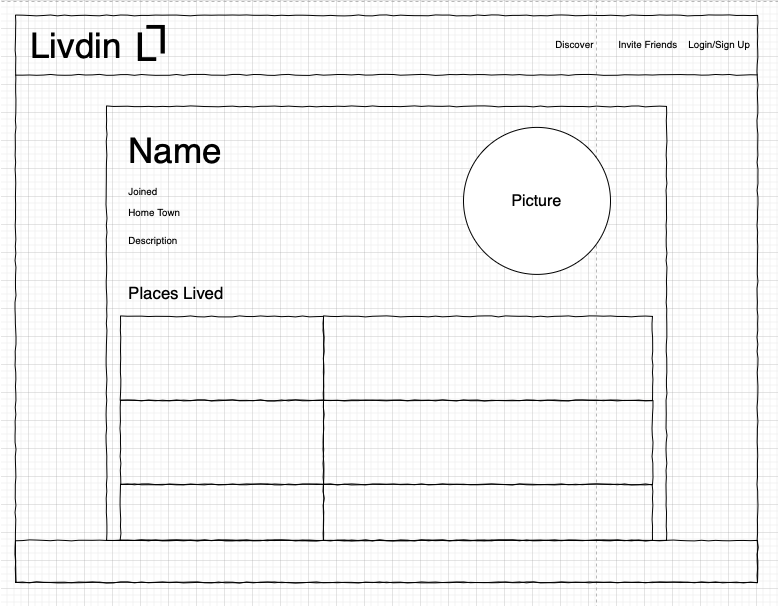

# Livdin

## Description 

Livdin is a web application that lets users post reviews on previous and current place of residence. The application is being designed with the idea of giving individuals a space to review their current place of residence free from the real estate pressure. Reviews can contain information such as expressing opinion of previous or current place of residence, how landlords handle maintaince issues, how expense utilities bills range etc.  

---
## User Story

AS A `renter`

I WANT `to know about the place I am living in or want move in to`

SO THAT I `can make an educated decision about where I want to live`

## Acceptance Criteria

GIVEN THAT `I the user am looking into rentals`

WHEN `the user finds a home they have lived in or is interested in`

THEN `they have the ability to write a review or receive a review history of the home/apartment`

---
## Getting Started

Instructions on how to use our applications in the future  

### The user lands on the home page of Livdin
* They have to ability to 
    * Search for an
        * __Address__
            * Returns a single home/apartment
        * __Neighborhood, City, County__
            * Returns a list of houses that are avaiable for rent/sale
        * Also clicking and holding on the map can create a point which will show you an and allow the user to write a review
    * Login/Signup to there profile
    * Invite friends to join the website
###  When the user enters a search
* They will be brought to the search results page
* Which will be a full screen map (If Possible)
* That will show them the results based on there search
* If the user clicks on an address
    * It will prompt the user if they have lived there or are going to live there
        * If they have lived there
            * Then they will be prompted to add a review
            * When a review is made on a address a row is created for that address
            * And also a new row is created on the review
                * Each address has many reviews, not every review has many addresses
        * if they havent lived there and are interested in living there
            * Then they will be shown reveiews from that adddress giving them insight on the history of the property
* This is the information we get from Zillow
* Most likely needing to link them to the listing on their website
* The user will also be able to write a review on any of the houses that show up as well

###  Goes to Their Profile
* The user will be able to edit user information such ass
    * Name
    * Age
    * Home Town
    * Reviews Written
    * Description
    * Interests

---
## WireFrame

Images of our frontend wireframe  

---
## Technology

* Need a CSS framework other than bootstrap
* Zillow API (possibly another real estate api)
* MapQuest API (to look up address of user input)
* Express Library
* Node 
* SQL database (handles user log in information and review posts)
* Sequelize
* Passport (node module that uses the middleware design pattern to authenticate requests.)
* bcrypt (offers salt hashing to further protect passwords in database)

---
## Tasks Break Down 02.04.2020 (remove for final readme.MD)

__Kurt__: play with the wireframe of the front end, and begin       connecting html pages with javascript interactions.  

__Ryan__: figure out real estate API, be able to make calls from Zillow or another real estate API  

__Dan__: begin creating our first model. Either handle reviews or check how our user log in information is being stored  

__Leo__: work with mapquest API, and be able to look up any address you want. 

---
## Team Lucky 7

* [Kurt LaVacque](https://github.com/livingkurt) 
* [Ryan Borja](https://github.com/SteelersFan254) 
* [Dan Fenichel](https://github.com/danfenichel) 
* [Leo Lopez](https://github.com/leolopez10) 

